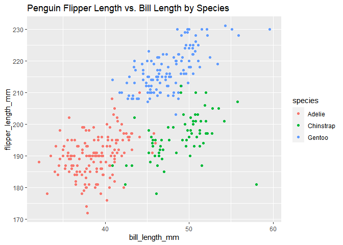

p8105_hw1_qz2266
================
Qing Zhou
2022-09-23

``` r
library(tidyverse)
```

    ## ── Attaching packages ─────────────────────────────────────── tidyverse 1.3.2 ──
    ## ✔ ggplot2 3.3.6      ✔ purrr   0.3.4 
    ## ✔ tibble  3.1.8      ✔ dplyr   1.0.10
    ## ✔ tidyr   1.2.0      ✔ stringr 1.4.1 
    ## ✔ readr   2.1.2      ✔ forcats 0.5.2 
    ## ── Conflicts ────────────────────────────────────────── tidyverse_conflicts() ──
    ## ✖ dplyr::filter() masks stats::filter()
    ## ✖ dplyr::lag()    masks stats::lag()

# Problem 1

## Descriptive summaries of the penguins dataset

``` r
data("penguins", package = "palmerpenguins")

ncol(penguins)
```

    ## [1] 8

``` r
colnames(penguins)
```

    ## [1] "species"           "island"            "bill_length_mm"   
    ## [4] "bill_depth_mm"     "flipper_length_mm" "body_mass_g"      
    ## [7] "sex"               "year"

``` r
nrow(penguins)
```

    ## [1] 344

``` r
mean(pull(penguins, flipper_length_mm), na.rm = TRUE)
```

    ## [1] 200.9152

``` r
class(pull(penguins, species))
```

    ## [1] "factor"

``` r
nlevels(pull(penguins, species))
```

    ## [1] 3

``` r
levels(pull(penguins, species))
```

    ## [1] "Adelie"    "Chinstrap" "Gentoo"

``` r
class(pull(penguins, bill_length_mm))
```

    ## [1] "numeric"

``` r
mean(pull(penguins, bill_length_mm), na.rm = TRUE)
```

    ## [1] 43.92193

``` r
median(pull(penguins, bill_length_mm), na.rm = TRUE)
```

    ## [1] 44.45

``` r
range(pull(penguins, bill_length_mm), na.rm = TRUE)
```

    ## [1] 32.1 59.6

The penguins data set has 8 variables, including species, island,
bill_length_mm, bill_depth_mm, flipper_length_mm, body_mass_g, sex,
year. There are 344 observations in total in this data set.

The mean flipper length (mm) is 200.9152047 after excluding two NAs.

Other important variables include species, which is a factor variable
and consists of 3 levels including Adelie, Chinstrap, Gentoo, and bill
length, which is a numeric variable, with the mean value of 43.9219298
mm, and the median value of 44.45 mm. Moreover, the range of values for
the penguin bill length is (32.1, 59.6 mm).

## Make a scatterplot and export the plot

``` r
ggplot(penguins, aes(x = bill_length_mm, y = flipper_length_mm, color = species)) + geom_point() + ggtitle("Penguin Flipper Length vs. Bill Length by Species")
```

    ## Warning: Removed 2 rows containing missing values (geom_point).

<!-- -->

``` r
ggsave("scatterplot_penguin.pdf", height = 4, width = 6)
```

    ## Warning: Removed 2 rows containing missing values (geom_point).

# Problem 2

## Create a data frame

``` r
prob2_df = 
  tibble(
    var_numeric = rnorm(10),
    var_logic = var_numeric > 10,
    var_char = c("My", "name", "is", "Vivian", "Zhou", "and", "I", "love", "data", "science"),
    var_factor = factor(c("mild", "mild", "mild", "moderate", "moderate", "moderate", "moderate","severe", "severe", "severe"))
  )
prob2_df
```

    ## # A tibble: 10 × 4
    ##    var_numeric var_logic var_char var_factor
    ##          <dbl> <lgl>     <chr>    <fct>     
    ##  1      2.34   FALSE     My       mild      
    ##  2      1.89   FALSE     name     mild      
    ##  3     -0.421  FALSE     is       mild      
    ##  4      0.548  FALSE     Vivian   moderate  
    ##  5     -0.205  FALSE     Zhou     moderate  
    ##  6     -1.14   FALSE     and      moderate  
    ##  7      0.0938 FALSE     I        moderate  
    ##  8     -0.0731 FALSE     love     severe    
    ##  9      0.404  FALSE     data     severe    
    ## 10      0.340  FALSE     science  severe
